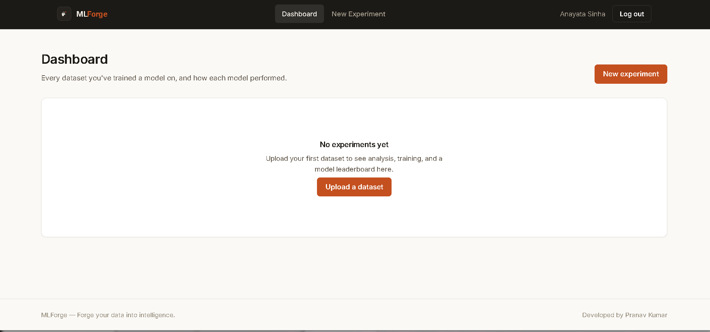
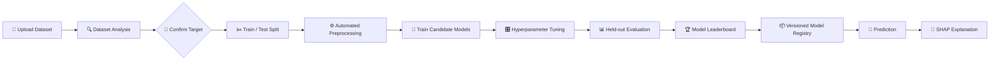
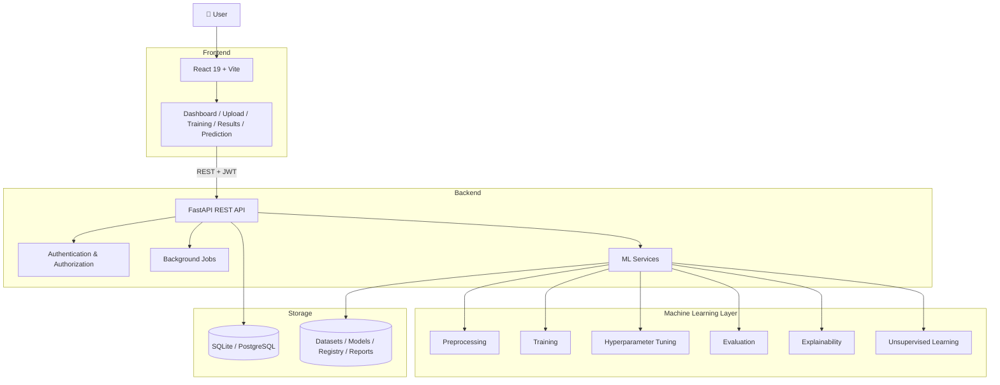
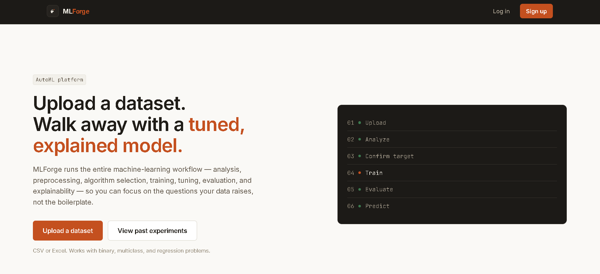
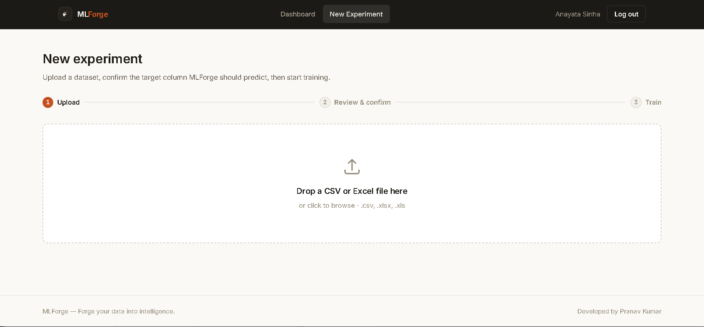
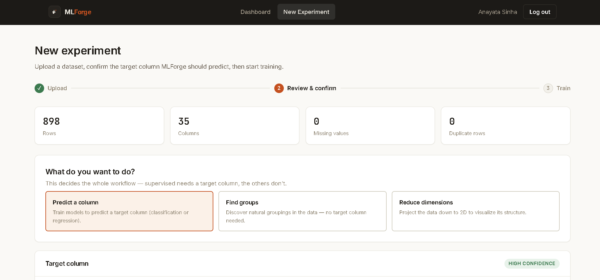
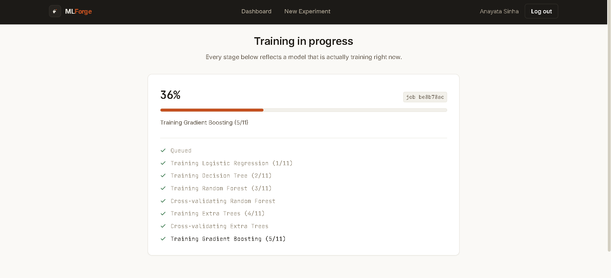
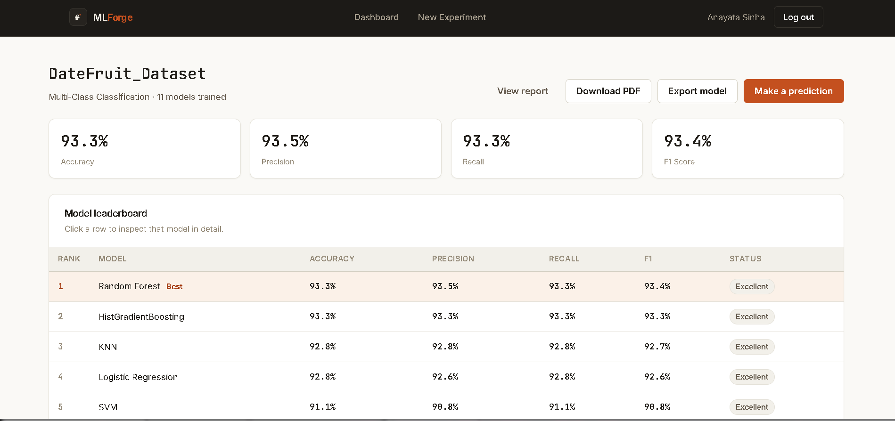
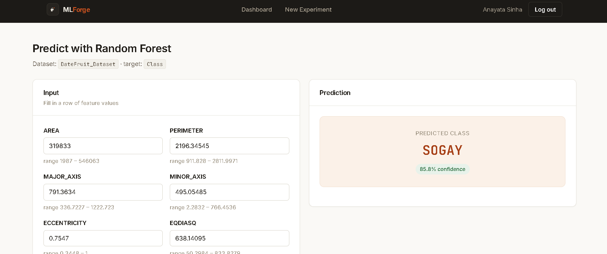
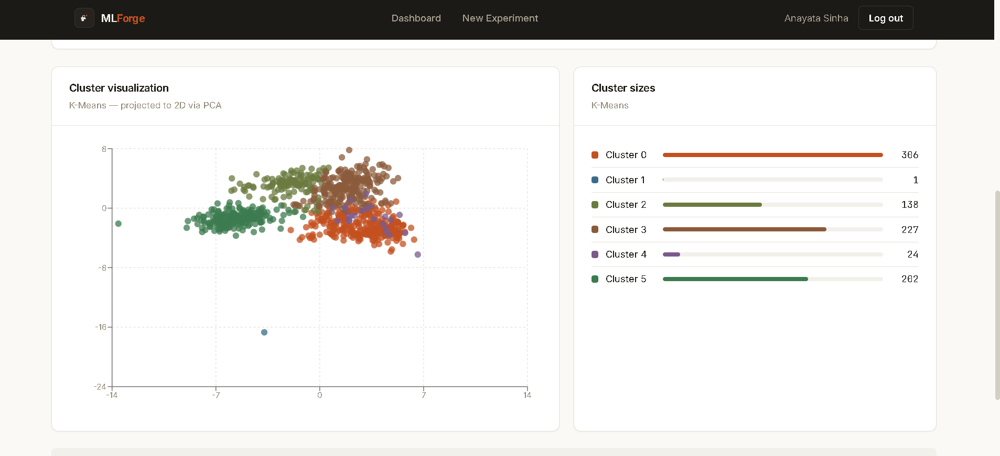

# ⚒️ MLForge

### Forge your data into intelligence.

**MLForge** is an integrated AutoML platform for **tabular machine learning** that automates the repetitive parts of the machine-learning workflow—from dataset analysis and preprocessing to model training, comparison, explainability, model versioning, and prediction.

Instead of manually building the same ML pipeline for every dataset, MLForge provides a single interface where users can upload their data, confirm the target variable, train and compare multiple algorithms, inspect model performance, understand predictions with SHAP, and manage trained models through a versioned registry.

<p align="center">
  
</p>

<p align="center">
  <a href="https://ml-forge-zeta.vercel.app">
    
  </a>
  <a href="https://github.com/pranavkumar9939/MLForge">
    
  </a>
</p>

<p align="center">


</p>

---

## 📖 Table of Contents

* [Overview](#-overview)
* [Why MLForge?](#-why-mlforge)
* [Key Features](#-key-features)
* [How MLForge Works](#-how-mlforge-works)
* [System Architecture](#-system-architecture)
* [Screenshots](#-screenshots)
* [Supported Machine Learning Tasks](#-supported-machine-learning-tasks)
* [Supported Models](#-supported-models)
* [Explainability](#-explainability)
* [Evaluation Results](#-evaluation-results)
* [Technology Stack](#-technology-stack)
* [Project Structure](#-project-structure)
* [Quick Start](#-quick-start)
* [Configuration](#-configuration)
* [Built-in Limits](#-built-in-limits)
* [API Overview](#-api-overview)
* [Testing](#-testing)
* [Security](#-security)
* [Known Limitations](#-known-limitations)
* [Roadmap](#-roadmap)
* [Research Paper](#-research-paper)
* [Citation](#-citation)
* [Author](#-author)
* [License](#-license)

---

# 📌 Overview

Machine-learning workflows often involve the same sequence of repetitive tasks:

**data loading → analysis → preprocessing → model selection → training → evaluation → explanation → deployment/prediction**

Performing these steps manually for every dataset is time-consuming and can introduce inconsistencies.

**MLForge** brings these stages together into a unified web platform.

The platform is designed around one principle:

> **Automate the repetitive parts, keep the important decisions visible.**

MLForge does not blindly choose a target variable or hide the training process. Instead, it analyzes the uploaded dataset, recommends a target column, and requires the user to confirm the target before training begins.

Every candidate model follows the same preprocessing and evaluation procedure, making the resulting leaderboard easier to compare.

---

# 💡 Why MLForge?

A conventional ML workflow can become difficult to maintain when experiments grow:

* preprocessing logic gets duplicated
* different models may receive different transformations
* missing values are handled inconsistently
* categorical features require repeated encoding
* trained models may be saved without their preprocessing steps
* model versions become difficult to track
* prediction interfaces have to be created manually
* explaining individual predictions requires additional tooling

MLForge addresses these problems by providing an integrated workflow.

### Core design principles

| Principle          | MLForge Approach                                         |
| ------------------ | -------------------------------------------------------- |
| Reproducibility    | Consistent preprocessing and fixed evaluation procedures |
| Leakage prevention | Preprocessing fitted inside model pipelines              |
| Model comparison   | Common evaluation procedure across candidates            |
| Explainability     | SHAP-based prediction explanations                       |
| Model management   | Versioned model registry                                 |
| Usability          | Web-based interface                                      |
| Extensibility      | Modular FastAPI backend and React frontend               |
| Deployment         | Docker-ready architecture                                |

---

# ✨ Key Features

## 📊 Dataset Analysis

Upload tabular datasets in:

* CSV
* XLSX
* XLS

MLForge automatically analyzes:

* number of rows and columns
* missing values
* duplicate records
* column data types
* unique-value counts
* memory usage
* candidate target columns
* dataset structure

Uploads are validated for file type, size and shape.

---

## 🎯 Intelligent Target Selection

MLForge analyzes the dataset and recommends potential target columns.

However, **training does not start automatically**.

The user explicitly confirms the target variable before the ML pipeline begins.

This prevents accidental training against an incorrect column.

---

## 🤖 Automatic Problem Detection

MLForge automatically identifies supported supervised learning problems:

* Binary classification
* Multi-class classification
* Regression

The selected problem type determines which preprocessing and candidate models are used.

---

## 🧹 Automated Preprocessing

MLForge creates preprocessing pipelines automatically.

### Numerical features

* Missing-value imputation
* Median strategy
* Standardisation

### Categorical features

* Missing-value imputation
* Most-frequent strategy
* One-hot encoding

### Additional preprocessing

* Datetime feature expansion
* Identifier-column detection
* Constant-column removal
* High-cardinality protection

Most importantly, preprocessing is fitted **only on the training portion** through the model pipeline.

This reduces the risk of data leakage.

---

## 🏋️ Automated Model Training

MLForge trains multiple candidate algorithms using a common evaluation procedure.

Users can select different tuning modes:

| Mode     | Iterations | Cross-validation |
| -------- | ---------: | ---------------: |
| Fast     |          5 |           3-fold |
| Balanced |         10 |           3-fold |
| Thorough |         25 |           5-fold |

Long-running training operations are handled as background jobs, with progress information exposed through the interface.

---

## 🏆 Model Comparison

After training, MLForge produces a ranked model leaderboard.

Depending on the problem type, the platform reports metrics such as:

### Classification

* Accuracy
* Precision
* Recall
* F1-score
* Confusion matrix
* ROC curve
* Feature importance

### Regression

* R²
* MAE
* Additional regression metrics

Models are ranked using a common scoring procedure to make comparison easier.

---

# 🔄 How MLForge Works



---

# 🏗️ System Architecture

MLForge follows a frontend/backend architecture.



---

# 📸 Screenshots

> Replace the following placeholders with screenshots from the actual MLForge application.

## Landing Page

<p align="center">
  
</p>

---

## Dashboard

<p align="center">
  
</p>

---

## Dataset Upload & Analysis

<p align="center">
  
  
</p>

---

## Training & Model Comparison

<p align="center">
  
  
</p>

---

## Explainability & Prediction

<p align="center">
  
  
</p>

---

## Model Registry

<p align="center">
  
</p>

---

# 🧠 Supported Machine Learning Tasks

## Supervised Learning

MLForge currently supports:

### Classification

* Binary classification
* Multi-class classification

### Regression

* Continuous numerical prediction

---

## Unsupervised Learning

MLForge also provides an experimental unsupervised-learning workflow.

### Clustering

Supported approaches include:

* K-Means
* MiniBatch K-Means
* Gaussian Mixture
* Birch
* DBSCAN
* Agglomerative Clustering
* Spectral Clustering
* OPTICS

Clustering results can be evaluated using:

* Silhouette Score
* Davies-Bouldin Index
* Calinski-Harabasz Index

### Dimensionality Reduction

Available techniques include:

* PCA
* Truncated SVD
* Kernel PCA
* ICA
* NMF
* t-SNE

---

# 🤖 Supported Models

## Classification

| Model                  | Category          |
| ---------------------- | ----------------- |
| Logistic Regression    | Linear            |
| Decision Tree          | Tree              |
| Random Forest          | Ensemble          |
| Extra Trees            | Ensemble          |
| Gradient Boosting      | Ensemble          |
| HistGradientBoosting   | Ensemble          |
| AdaBoost               | Ensemble          |
| Gaussian Naive Bayes   | Probabilistic     |
| K-Nearest Neighbors    | Instance-based    |
| Support Vector Machine | Kernel            |
| XGBoost                | Gradient Boosting |

### Optional integrations

Where supported by the installed environment:

* LightGBM
* CatBoost

---

## Regression

| Model                          | Category          |
| ------------------------------ | ----------------- |
| Linear Regression              | Linear            |
| Ridge                          | Linear            |
| Lasso                          | Linear            |
| ElasticNet                     | Linear            |
| Decision Tree Regressor        | Tree              |
| Random Forest Regressor        | Ensemble          |
| Extra Trees Regressor          | Ensemble          |
| Gradient Boosting Regressor    | Ensemble          |
| HistGradientBoosting Regressor | Ensemble          |
| K-Nearest Neighbors Regressor  | Instance-based    |
| Support Vector Regression      | Kernel            |
| XGBoost Regressor              | Gradient Boosting |

Optional LightGBM and CatBoost integrations may also be available depending on the environment.

---

# 🧠 Explainability

MLForge integrates **SHAP (SHapley Additive exPlanations)** to make model predictions more understandable.

For supported models, MLForge can provide:

* feature contributions
* positive/negative influence
* prediction-level explanations
* model interpretation visualisations

The platform selects an appropriate SHAP explanation strategy depending on the model type.

This allows users to move beyond:

> "The model predicted this."

and instead investigate:

> "Which features contributed to this prediction, and in what direction?"

---

# 📦 Model Registry

MLForge provides versioned model storage.

Models follow a structure conceptually similar to:

```text
dataset/
└── model/
    ├── version-1/
    ├── version-2/
    └── version-3/
```

The registry stores model versions and supports:

* model listing
* version tracking
* production-version selection
* model retrieval
* prediction using registered models

Each trained model is stored together with the preprocessing pipeline required to transform its input data.

---

# 🔮 Prediction

MLForge provides both interactive and batch prediction.

## Single Prediction

The prediction interface is generated from the stored input schema of the selected model.

Users can provide feature values through the web interface and receive:

* prediction
* confidence/probability where applicable
* model information
* SHAP explanation

## Batch Prediction

Users can upload CSV/XLSX files for batch inference.

Current configured limit:

**5,000 prediction rows per batch.**

Results can be downloaded for further analysis.

---

# 📊 Evaluation Results

MLForge was evaluated on six public datasets using a common default procedure:

* 80/20 train-test split
* random seed = 42
* stratification for classification where applicable
* held-out test evaluation

### Results

| Dataset               | Task                       | Test Size | Best Model    | Result                    |
| --------------------- | -------------------------- | --------: | ------------- | ------------------------- |
| Pima Indians Diabetes | Binary Classification      |       154 | Decision Tree | Accuracy 79.9% · F1 71.0% |
| Wine                  | Multi-class Classification |        36 | Extra Trees*  | Accuracy 100%             |
| Digits                | Multi-class Classification |       360 | SVM           | Accuracy 98.1%            |
| Date Fruit            | Multi-class Classification |       180 | Random Forest | Accuracy 93.3%            |
| California Housing    | Regression                 |     4,128 | XGBoost       | R² 0.843 · MAE 0.293      |
| Diabetes Progression  | Regression                 |        89 | Extra Trees   | R² 0.484 · MAE 43.05      |

* The Wine dataset produced a five-way tie for the reported top result.

### ⚠️ Interpreting the results

These results should not be interpreted as universal benchmarks.

Each dataset was evaluated using one split and one random seed, and some test sets are relatively small. Furthermore, model selection and final reporting use the same held-out evaluation set.

Therefore, these numbers should be considered **held-out leaderboard results rather than unbiased estimates of a model-selection procedure**.

This limitation motivates the planned introduction of nested and repeated cross-validation.

---

# 🧰 Technology Stack

| Layer            | Technologies                                  |
| ---------------- | --------------------------------------------- |
| Frontend         | React 19, Vite, React Router, Axios, Recharts |
| Backend          | FastAPI, Uvicorn, Pydantic Settings           |
| Machine Learning | scikit-learn, XGBoost, pandas, NumPy          |
| Optional ML      | LightGBM, CatBoost                            |
| Explainability   | SHAP                                          |
| Visualization    | Matplotlib, Recharts                          |
| Reporting        | ReportLab                                     |
| Authentication   | JWT, bcrypt                                   |
| Storage          | joblib, JSON, SQLite                          |
| Testing          | pytest, Vitest, Testing Library               |
| Deployment       | Docker, Nginx                                 |

---

# 🗂️ Project Structure

```text
MLForge/
│
├── backend/
│   │
│   ├── app/
│   │   ├── api/
│   │   │   └── ...              # FastAPI routers
│   │   │
│   │   ├── core/
│   │   │   └── ...              # Configuration & security
│   │   │
│   │   ├── database/
│   │   │   └── ...              # Database configuration
│   │   │
│   │   ├── models/
│   │   │   └── ...              # Database models
│   │   │
│   │   ├── schemas/
│   │   │   └── ...              # Pydantic schemas
│   │   │
│   │   ├── services/
│   │   │   ├── preprocessing/
│   │   │   ├── training/
│   │   │   ├── tuning/
│   │   │   ├── evaluation/
│   │   │   ├── explainability/
│   │   │   ├── registry/
│   │   │   ├── unsupervised/
│   │   │   └── reports/
│   │   │
│   │   ├── utils/
│   │   └── main.py
│   │
│   ├── tests/
│   ├── Dockerfile
│   └── requirements.txt
│
├── frontend/
│   │
│   ├── src/
│   │   ├── pages/
│   │   ├── components/
│   │   ├── context/
│   │   ├── lib/
│   │   └── test/
│   │
│   ├── Dockerfile
│   └── nginx.conf
│
├── docs/
│   └── screenshots/
│
├── README.md
└── LICENSE
```

---

# 🚀 Quick Start

## Prerequisites

Make sure the following are installed:

* Python 3.12
* Node.js 22 or a recent LTS version
* npm
* Git

---

## 1. Clone the Repository

```bash
git clone https://github.com/pranavkumar9939/MLForge.git

cd MLForge
```

---

# 2. Start the Backend

```bash
cd backend
```

### Create a virtual environment

### Windows

```powershell
python -m venv venv
venv\Scripts\activate
```

### Linux / macOS

```bash
python3 -m venv venv
source venv/bin/activate
```

### Install dependencies

```bash
pip install -r requirements.txt
```

### Configure environment variables

```bash
cp .env.example .env
```

On Windows PowerShell, you can alternatively copy the file manually:

```powershell
Copy-Item .env.example .env
```

### Start FastAPI

```bash
uvicorn app.main:app --reload --port 8000
```

Backend:

```text
http://localhost:8000
```

Swagger API documentation:

```text
http://localhost:8000/docs
```

Health check:

```text
http://localhost:8000/health
```

---

# 3. Start the Frontend

Open another terminal:

```bash
cd frontend
```

Install dependencies:

```bash
npm install
```

Start the development server:

```bash
npm run dev
```

Open:

```text
http://localhost:5173
```

By default, the frontend communicates with:

```text
http://localhost:8000
```

The backend URL can be changed through:

```text
VITE_API_URL
```

---

# 🐳 Docker Deployment

MLForge can also be run using Docker.

## Backend

```bash
docker build -t mlforge-backend ./backend
```

Run:

```bash
docker run -d \
  -p 8000:8000 \
  -v mlforge_data:/app/data \
  -e SECRET_KEY="YOUR_SECURE_SECRET_KEY" \
  -e CORS_ORIGINS='["http://localhost:3000"]' \
  mlforge-backend
```

---

## Frontend

Build the frontend:

```bash
docker build \
  -t mlforge-frontend \
  --build-arg VITE_API_URL=http://localhost:8000 \
  ./frontend
```

Run:

```bash
docker run -d \
  -p 3000:80 \
  mlforge-frontend
```

Open:

```text
http://localhost:3000
```

### Production warning

When deploying MLForge in production:

* use a strong random `SECRET_KEY`
* configure the correct CORS origins
* use HTTPS
* avoid development credentials
* protect database and model storage

---

# ⚙️ Configuration

Backend configuration can be supplied through environment variables or a `.env` file.

| Variable                      | Default                  | Description                 |
| ----------------------------- | ------------------------ | --------------------------- |
| `ENVIRONMENT`                 | `development`            | Application environment     |
| `SECRET_KEY`                  | Development value        | JWT signing secret          |
| `DATABASE_URL`                | `sqlite:///./mlforge.db` | User database               |
| `UPLOAD_DIR`                  | `./uploads`              | Uploaded datasets           |
| `SAVED_MODELS_DIR`            | `./saved_models`         | Trained models and registry |
| `CORS_ORIGINS`                | localhost origins        | Allowed frontend origins    |
| `MAX_UPLOAD_SIZE_MB`          | `200`                    | Maximum upload size         |
| `ACCESS_TOKEN_EXPIRE_MINUTES` | `10080`                  | JWT lifetime                |

Frontend configuration:

```text
VITE_API_URL
```

controls the backend API address at build time.

---

# 📏 Built-in Limits

| Setting                   |           Current Value |
| ------------------------- | ----------------------: |
| Maximum upload size       |                  200 MB |
| Minimum dataset size      |                 20 rows |
| Full model sweep          |       Up to 50,000 rows |
| Expensive models skipped  |      Above 200,000 rows |
| One-hot cardinality limit |      50 values / column |
| Batch prediction          |              5,000 rows |
| Fast tuning               |  5 iterations × 3 folds |
| Balanced tuning           | 10 iterations × 3 folds |
| Thorough tuning           | 25 iterations × 5 folds |

These limits are designed to keep interactive workloads practical on typical development hardware.

---

# 🔌 API Overview

MLForge exposes its backend through a FastAPI REST API.

Interactive API documentation is available at:

```text
http://localhost:8000/docs
```

Major API areas include:

| API Area               | Purpose                                         |
| ---------------------- | ----------------------------------------------- |
| Authentication         | Registration, login and current-user operations |
| Upload / Datasets      | Dataset upload and analysis                     |
| Training / Jobs        | Training initiation and job status              |
| Models                 | Model listing and comparison                    |
| Leaderboard            | Ranked model performance                        |
| Metrics                | Evaluation metrics and visualisations           |
| ROC / Confusion Matrix | Classification analysis                         |
| Feature Importance     | Model interpretation                            |
| Tuning                 | Hyperparameter optimization                     |
| Registry               | Model versions and production promotion         |
| Prediction             | Single predictions                              |
| Batch Prediction       | File-based predictions                          |
| Prediction History     | Historical predictions                          |
| Unsupervised           | Clustering and dimensionality reduction         |
| Reports / Export       | PDF and result export                           |

---

# 🧪 Testing

## Backend

Install development dependencies:

```bash
cd backend

pip install -r requirements-dev.txt
```

Run:

```bash
pytest
```

The backend test suite covers areas such as:

* authentication
* ownership checks
* dataset upload
* training
* prediction
* export
* reports
* model registry
* unsupervised learning
* health checks
* error handling

---

## Frontend

```bash
cd frontend

npm test
```

Frontend tests use:

* Vitest
* Testing Library

---

# 🔐 Security

MLForge includes several security mechanisms.

### Authentication

* JWT bearer authentication
* bcrypt password hashing
* authenticated API access

### Authorization

Dataset and job operations are checked against the authenticated user.

### Error handling

A global exception-handling layer prevents internal errors from being unnecessarily exposed to clients while allowing detailed server-side logging.

### Deployment security

Production deployments should always use:

* strong secret keys
* HTTPS
* restricted CORS origins
* secure infrastructure
* protected persistent storage

---

# ⚠️ Known Limitations

MLForge is an actively developing project. Several areas remain open for improvement.

### Model selection and evaluation

The current evaluation workflow uses the same held-out dataset for model selection and final reporting.

A future implementation will use:

* nested cross-validation
* repeated cross-validation
* stronger statistical comparison

### Storage

Models, registry information and prediction history are currently stored primarily through files such as:

```text
joblib
JSON
```

This works well for local and small-team usage but is not designed for large-scale concurrent workloads.

### Experiment tracking

The relational database currently focuses primarily on user accounts.

Full experiment tracking and dataset-version management are planned.

### Token storage

Access tokens are currently stored in browser local storage. Production deployments should consider a more hardened authentication architecture.

### Monitoring

The current version does not yet provide:

* model drift detection
* automated retraining
* production monitoring
* distributed training

### Benchmark coverage

The current evaluation is limited in scope. Broader datasets containing mixed data types, large categorical features and more challenging missing-data patterns should be included in future benchmarking.

---

# 🛣️ Roadmap

The planned evolution of MLForge includes:

* [ ] Nested cross-validation
* [ ] Repeated cross-validation
* [ ] Experiment tracking
* [ ] Dataset versioning
* [ ] Improved model registry
* [ ] Model deployment endpoints
* [ ] Model monitoring
* [ ] Data and model drift detection
* [ ] Automated retraining
* [ ] Role-based access control
* [ ] CI/CD pipeline
* [ ] Distributed training
* [ ] Larger AutoML benchmark
* [ ] Comparison with established AutoML frameworks
* [ ] Improved production-scale storage
* [ ] Cloud deployment support

---

# 📄 Research Paper

MLForge is accompanied by a research paper titled:

> **MLForge: An Integrated AutoML Platform**

The paper describes the architecture, machine-learning workflow, preprocessing strategy, model evaluation methodology and experimental results.

The evaluation discussed in the paper includes the six datasets presented in this README.

---

# 📚 Citation

If you use MLForge in academic work, research or another project, please cite:

```bibtex
@misc{kumar2026mlforge,
  author       = {Kumar, Pranav},
  title        = {{MLForge}: An Integrated {AutoML} Platform},
  year         = {2026},
  howpublished = {\url{https://github.com/pranavkumar9939/MLForge}}
}
```

---

# 👨‍💻 Author

## Pranav Kumar

**Department of Computer Science and Engineering (AI & ML)**
**Nalanda College of Engineering**
Chandi, Nalanda, Bihar, India

GitHub: [@pranavkumar9939](https://github.com/pranavkumar9939)

Email: `pranavvicky9939@gmail.com`

---

# 📜 License

MLForge is released under the **MIT License**.

See [`LICENSE`](LICENSE) for details.

---

<p align="center">

### ⚒️ MLForge

**Forge your data into intelligence.**

⭐ If you find MLForge useful, consider giving the repository a star.

</p>

<p align="center">
  Built with ❤️ using Python, FastAPI, React and modern machine-learning tools.
</p>
